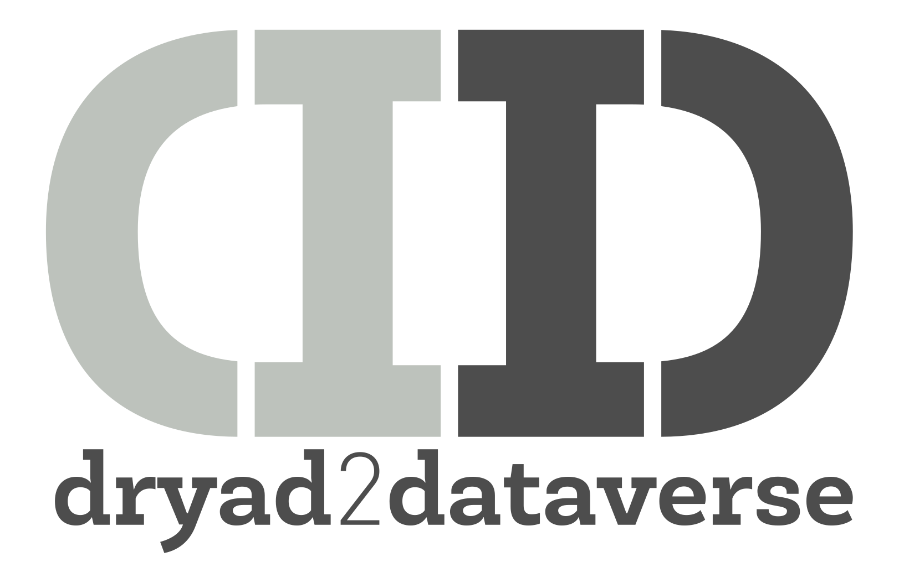

---

## Zero effort migrations

If you can edit a text file, you can move material from a Dryad repository to a Dataverse repository.

----
## Quick start 

If you don't have **pipx**, [install it](https://pipx.pypa.io/latest/installation/){:target="_blank}.

```nohighlight
pipx install dryad2dataverse
dryadd
```
Fill in the newly created configuration file with your information. Then you're set. All you need type is six characters:

```nohighlight
dryadd
```

## Features

* **Dryadd** will run on just about anything. No dedictated server is required. If your platform can run Python, it can run **dryadd**<sup>1</sup>.
* Setup is easy, requiring editing only a single file with your institution's information.
* All transfer information is held in a single SQLite database, so you can easy move between machines.
* **Dryadd** handles updates to existing material so that you don't have to worry about it.
* **Dryad2dataverse** for Python can be easily incorporated into other products if you need a custom solution.
* It's free and open source.

----
<sup>1</sup> Assuming you have enough storage
